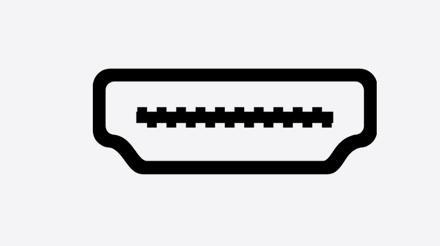

# PG27UCDM 输入源切换工具

[English](README.md)

一个用于 ASUS ROG Swift OLED PG27UCDM 的 macOS 输入源切换命令行工具。

`pg27switch` 会在所有已连接显示器上显示原生 macOS HUD，倒计时结束后调用 BetterDisplay 发送 DDC 输入源切换命令。倒计时期间可以按 ESC 取消。

详细用法：[docs/usage.md](docs/usage.md)

## 演示效果



## 功能

- 原生 macOS HUD 倒计时
- 切换前可按 ESC 取消
- 适合 Stream Deck 调用的命令行接口
- 通过 BetterDisplay DDC 切换输入源
- 支持 DisplayPort、HDMI 1、HDMI 2、Type-C 快捷名

## 环境要求

- macOS 12 或更高版本
- Xcode Command Line Tools
- BetterDisplay 安装在 `/Applications/BetterDisplay.app`
- 在 BetterDisplay 中启用 PG27UCDM 的 DDC 控制

如未安装 Xcode Command Line Tools：

```bash
xcode-select --install
```

## 编译

```bash
./macos/build.sh
```

输出文件：

```text
build/pg27switch
```

构建脚本使用 `xcrun swiftc`，默认按当前 Mac 架构编译，并将模块缓存写入 `build/module-cache`。

也可以手动指定目标：

```bash
ARCH=arm64 MACOS_TARGET=12.0 ./macos/build.sh
```

```bash
ARCH=x86_64 MACOS_TARGET=12.0 ./macos/build.sh
```

## 云编译

项目已包含 GitHub Actions workflow：

```text
.github/workflows/release.yml
```

手动云编译：

```text
GitHub 仓库 -> Actions -> Build and Release -> Run workflow
```

`release_tag` 留空时只上传 workflow artifact。填入 `v1.0.0` 这样的版本号时，会创建 GitHub Release，并把构建文件挂到 Release 里。

创建 Release 编译：

```bash
git tag v1.0.0
git push origin v1.0.0
```

workflow 会分别编译 `arm64` 和 `x86_64`，再合并成 macOS universal 二进制，并上传：

```text
pg27switch-macos-universal.zip
pg27switch-macos-universal.zip.sha256
```

推送 tag 后会自动创建 GitHub Release。

## 运行

只预览 HUD，不切换输入源：

```bash
./build/pg27switch --preview hdmi1
```

切换输入源：

```bash
./build/pg27switch hdmi1
```

查看帮助：

```bash
./build/pg27switch --help
```

输入源快捷名：

```text
dp, displayport          DisplayPort  15
h1, hdmi1                HDMI 1       17
h2, hdmi2                HDMI 2       18
tc, typec, usb-c, usbc   Type-C       26
```

## 安装

```bash
./macos/install.sh
```

安装到：

```text
/usr/local/bin/pg27switch
```

安装后确认：

```bash
pg27switch --help
```

## Stream Deck

使用 Mac Script Runner，语言选择 `Zsh`。每个按钮放一条命令：

```zsh
/usr/local/bin/pg27switch hdmi1
```

```zsh
/usr/local/bin/pg27switch hdmi2
```

```zsh
/usr/local/bin/pg27switch dp
```

```zsh
/usr/local/bin/pg27switch usbc
```

配置时可以先用预览模式测试 HUD：

```zsh
/usr/local/bin/pg27switch --preview hdmi1
```

## 源码结构

```text
macos/Sources/ArgumentParser.swift       命令行参数解析和 help 文本
macos/Sources/BetterDisplayClient.swift  BetterDisplay 调用封装
macos/Sources/CountdownController.swift  HUD 倒计时和切换流程
macos/Sources/HUDWindow.swift            原生 HUD 窗口
macos/Sources/InputIconView.swift        输入源图标
macos/Sources/Logger.swift               文件日志
macos/Sources/main.swift                 程序入口
macos/build.sh                           构建脚本
macos/install.sh                         本地安装脚本
docs/usage.md                            使用文档
```

## 上传 GitHub

发布前建议添加 `LICENSE` 文件。没有许可证时，其他人没有明确的复用和贡献权限。

建议提交：

```text
.gitignore
README.md
README.zh-CN.md
docs/
macos/
```

已忽略的生成文件：

```text
build/
.DS_Store
macos/launchers/*.command
PG27UCDM_Input_Switcher_Development_Document.docx
```

初始化并上传：

```bash
git init
git add .gitignore README.md README.zh-CN.md docs macos
git commit -m "Initial PG27UCDM input switcher"
git branch -M main
git remote add origin https://github.com/YOUR_NAME/pg27switch.git
git push -u origin main
```

## 日志

日志写入：

```text
~/Library/Logs/PG27UCDMSwitcher/pg27switch.log
```

如果该目录不可用，程序会回退到系统临时目录。
